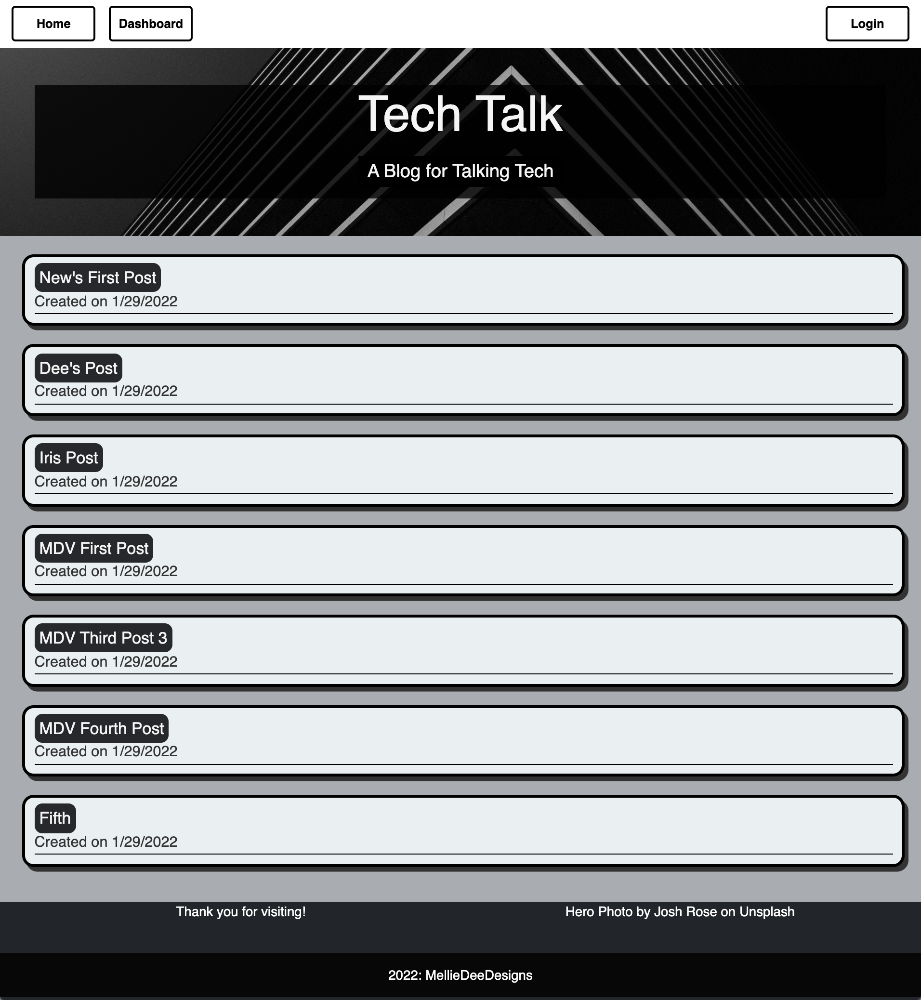
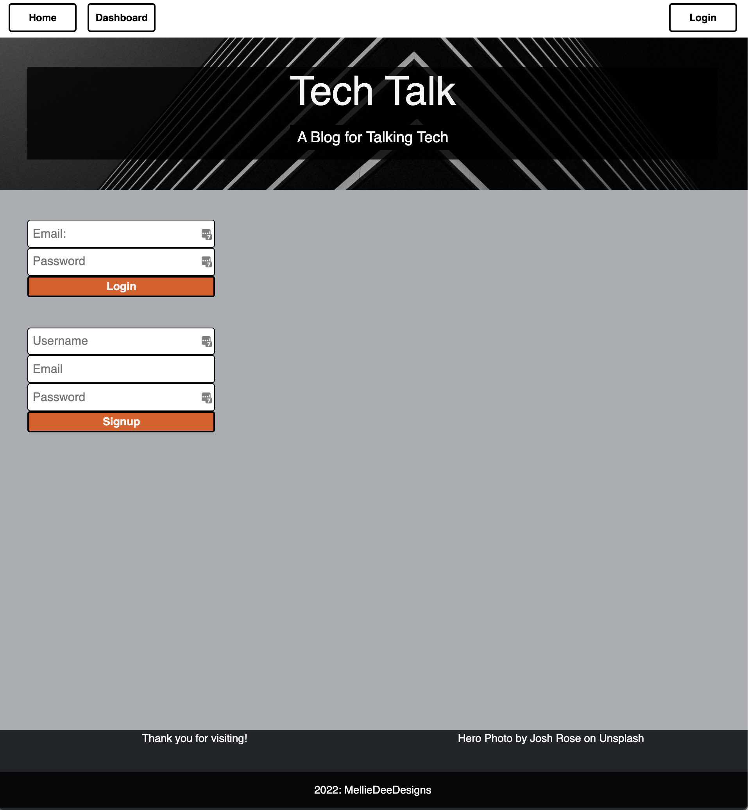
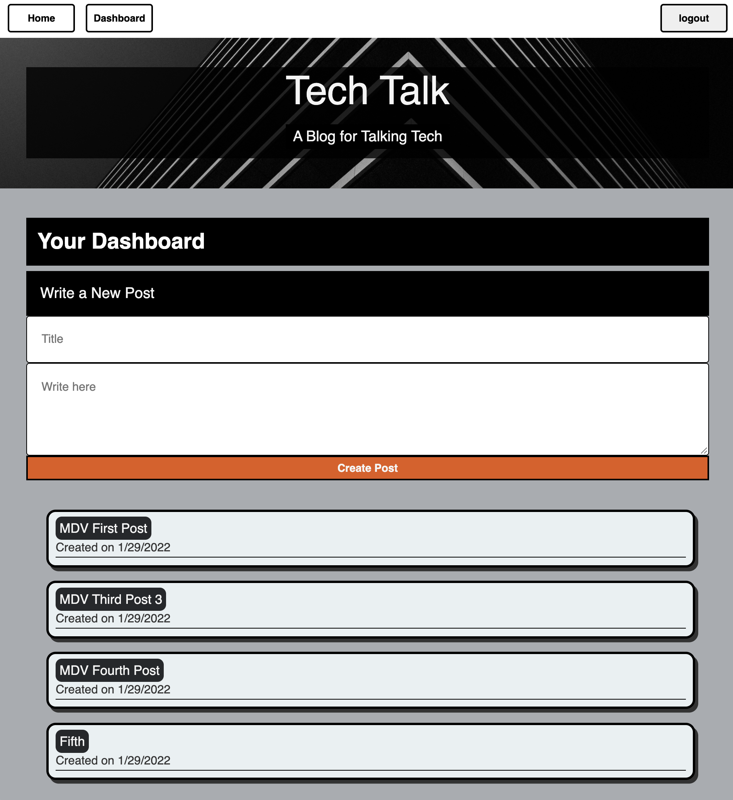

# **Tech Talk**
&nbsp;

&nbsp;

## **Project Description**
***
A simple social app for talking about tech that uses MySql, Handlebars, and Node and is deployed to Heroku using JAWSDB.

&nbsp;

## Table of Contents
***
* [Installation](#installation)
* [Usage](#usage)
* [URL](#url)
* [Screenshot](#screenshot)
* [Contributing](#contributing)
* [Tests](#tests)
* [Resources](#resources)
* [Questions](#questions)
* [License](#license)

&nbsp;

## **Installation**
***
No installation - just navigate to the site! [Tech Talk](https://mdd-tech-talk.herokuapp.com/)

&nbsp;

## **Usage**
***
- Visit [Tech Talk](https://mdd-tech-talk.herokuapp.com/)
- View the existing posts from the homepage. 
- Navigate to the Login page to Signup or Login.
- Once logged in, users are redirected to Dashboar, and from there they can create a post, or view, update or delete their existing posts.
- Logging in also allows users to comments on others' posts.  

&nbsp;

## **URL**
***

https://mdd-tech-talk.herokuapp.com/

&nbsp;

## **Screenshot**
***

&nbsp;

&nbsp;

### **Contributing**
***
Not accepting contributors.

&nbsp;

### **Tests**
***
No tests at this time.

&nbsp;

### **Resources**
***
#### I Used or Was Inspired By

https://designshack.net/articles/trends/best-website-color-schemes/
https://developer.mozilla.org/en-US/docs/Web/API/Fetch_API/Using_Fetch
https://developer.mozilla.org/en-US/docs/Web/API/Fetch_API/Using_Fetch#body
https://dev.to/raevilman/rest-api-flowchart-with-swimlanes-36lc
https://www.freecodecamp.org/news/rest-api-tutorial-rest-client-rest-service-and-api-calls-explained-with-code-examples/
https://www.gliffy.com/blog/use-uml-to-map-out-your-api
https://handlebarsjs.com/installation/when-to-use-handlebars.html#when-not-to-use-handlebars
https://www.sitepoint.com/overview-javascript-templating-engines/
https://stackoverflow.com/questions/64566276/fetching-data-from-findall-and-pass-it-to-ejs-file
https://unsplash.com/license

  

  

&nbsp;

### **Questions**
***
Reach me directly at  MellieDeeDevelops@outlook.com    
Or checkout out my GitHub profile:  [github.com/MellieDee](https://github.com/MellieDee)

&nbsp;

### **License**
***
Copyright (c) Melanie Dubberley. 

Licensed under the [MIT](https://choosealicense.com/licenses) license.
    
&nbsp;
      
 

##### Return to:
***
* [Installation](#installation)
* [Usage](#usage)
* [URL](#url)
* [Screenshot](#screenshot)
* [Contributing](#contributing)
* [Tests](#tests)
* [Resources](#resources)
* [Questions](#questions)
* [License](#license)

&nbsp;

